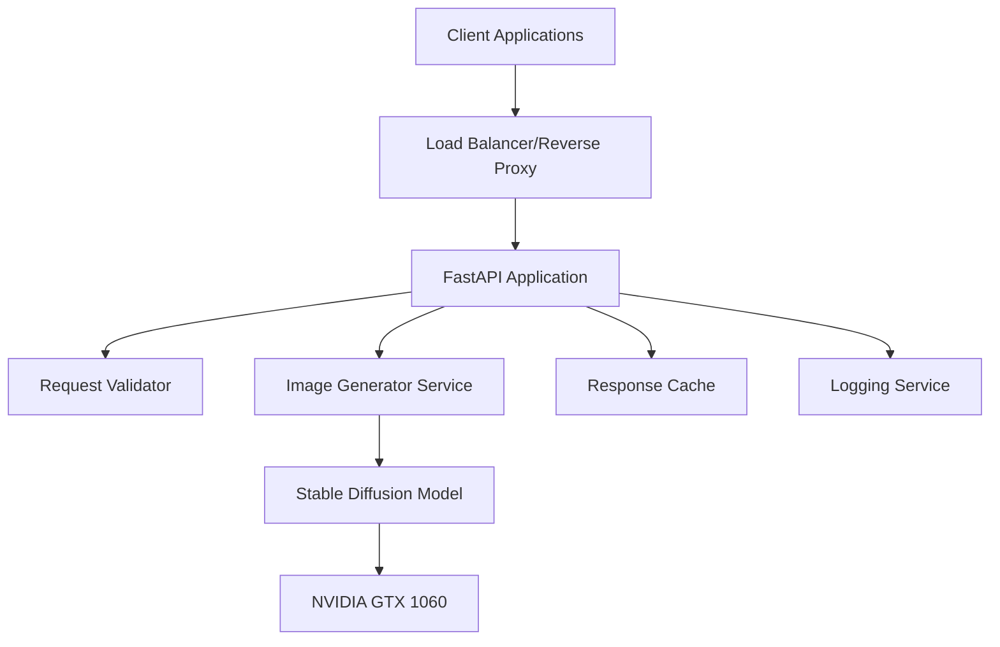

# Design Document

## Overview

The stable diffusion API is a containerized REST service built with FastAPI and PyTorch, designed to run efficiently on GeForce GTX 1060 6GB hardware. The service uses Stable Diffusion 1.5 with optimizations for memory-constrained environments, including attention slicing and CPU offloading techniques.

## Architecture

### High-Level Architecture



### Container Architecture

- **Base Image**: nvidia/cuda:11.8-runtime-ubuntu20.04
- **Python Runtime**: Python 3.9+
- **GPU Support**: CUDA 11.8 with cuDNN
- **Model Storage**: Persistent volume for model weights
- **Memory Management**: Attention slicing and model CPU offloading

## Components and Interfaces

### 1. FastAPI Application Layer

**Purpose**: HTTP request handling and API routing

**Key Components**:
- Request/Response models using Pydantic
- Async request handlers
- Middleware for logging and error handling
- Health check endpoints

**Interfaces**:
```python
@app.post("/generate")
async def generate_image(request: ImageGenerationRequest) -> ImageGenerationResponse

@app.get("/health")
async def health_check() -> HealthResponse
```

### 2. Request Validation Service

**Purpose**: Validate and sanitize incoming requests

**Key Components**:
- Parameter validation (steps: 1-50, dimensions: 256x256 to 768x768)
- Text prompt sanitization
- Default value assignment

**Validation Rules**:
- Steps: Integer between 1-50, default 20
- Width/Height: Multiples of 64, range 256-768, default 512
- Prompt: Non-empty string, max 500 characters
- Seed: Optional integer, random generation if not provided

### 3. Image Generation Service

**Purpose**: Core stable diffusion image generation

**Key Components**:
- Model initialization and management
- Memory optimization (attention slicing)
- GPU/CPU memory management
- Generation pipeline orchestration
- Seed management and random seed generation

**Memory Optimizations for GTX 1060**:
- Enable attention slicing: `pipe.enable_attention_slicing(1)`
- CPU offloading: `pipe.enable_sequential_cpu_offload()`
- Half precision: `torch_dtype=torch.float16`
- Model variant: `runwayml/stable-diffusion-v1-5` (open source, no API keys required)
- Local inference: All processing runs locally on your hardware

### 4. Response Formatting Service

**Purpose**: Format generated images for API response

**Key Components**:
- Image to base64 conversion
- Metadata attachment
- Error response formatting

## Data Models

### Request Model
```python
class ImageGenerationRequest(BaseModel):
    prompt: str = Field(..., min_length=1, max_length=500)
    steps: int = Field(default=20, ge=1, le=50)
    width: int = Field(default=512, ge=256, le=768)
    height: int = Field(default=512, ge=256, le=768)
    seed: Optional[int] = Field(default=None, ge=0, le=2**32-1)
    
    @validator('width', 'height')
    def validate_dimensions(cls, v):
        if v % 64 != 0:
            raise ValueError('Dimensions must be multiples of 64')
        return v
```

### Response Model
```python
class ImageGenerationResponse(BaseModel):
    image_base64: str
    metadata: GenerationMetadata
    
class GenerationMetadata(BaseModel):
    prompt: str
    steps: int
    width: int
    height: int
    seed: int
    generation_time_seconds: float
    model_version: str
```

### Error Model
```python
class ErrorResponse(BaseModel):
    error: str
    details: Optional[str] = None
    error_code: str
```

## Error Handling

### GPU Availability
- Check CUDA availability on startup
- Graceful fallback to CPU if GPU unavailable
- Log GPU status and memory information

### Memory Management
- Monitor VRAM usage during generation
- Implement circuit breaker for memory exhaustion
- Clear GPU cache between requests

### Request Timeouts
- 60-second timeout for image generation
- Return HTTP 408 for timeout scenarios
- Cleanup partial generation state

### Model Loading Errors
- Retry mechanism for model download failures
- Validate model integrity on startup
- Return HTTP 503 if model unavailable

## Testing Strategy

### Unit Tests
- Request validation logic
- Image generation pipeline components
- Error handling scenarios
- Memory management utilities

### Integration Tests
- End-to-end API request/response flow
- GPU memory usage validation
- Container startup and shutdown
- Model loading and initialization

### Performance Tests
- Generation time benchmarks
- Memory usage profiling
- Concurrent request handling
- Resource cleanup verification

### Hardware-Specific Tests
- GTX 1060 memory constraint validation
- CUDA compatibility verification
- Performance optimization validation

## Deployment Configuration

### Docker Configuration
```dockerfile
FROM nvidia/cuda:11.8-runtime-ubuntu20.04
ENV DEBIAN_FRONTEND=noninteractive
WORKDIR /app
EXPOSE 8000
CMD ["uvicorn", "main:app", "--host", "0.0.0.0", "--port", "8000"]
```

### Environment Variables
- `CUDA_VISIBLE_DEVICES`: GPU device selection
- `MODEL_CACHE_DIR`: Model storage location
- `MAX_CONCURRENT_REQUESTS`: Request concurrency limit
- `LOG_LEVEL`: Logging verbosity

### Resource Limits
- Memory: 8GB container limit
- GPU Memory: 5GB VRAM usage limit
- CPU: 4 cores recommended
- Storage: 10GB for model weights